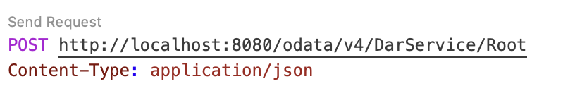

# SAP CAP Java Application Development Guide - Backend

## Introduction
This guide walks you through the steps to develop an SAP CAP (Cloud Application Programming) Java application that calls a DAR Model for inference using OAuth 2.0 authentication.

## Prerequisites
Ensure you have the following installed:
- Node.js (LTS version)
- Java 11 or later
- Maven
- SAP Business Application Studio or VS Code with CDS plugin
- Postman or Insomnia for testing APIs

## Step 1: Create a New CAP Java Project
1. Open a terminal and navigate to your working directory.
2. Run the following command to create a new CAP project with Java support:
   ```sh
   cds init dar-service --add java
   ```
3. Navigate into the project:
   ```sh
   cd dar-service
   ```

## Step 2: Define the CDS Model
Inside the `srv` folder, create a new file `dar-service.cds` and define the service and entities:

```cds
service DarService {
    entity features {
        key ID     : UUID;
            parent : Association to objects;
            name   : String(40);
            value  : String(40);
    }

    entity objects {
        key ID : UUID;
        parent : Association to Root;
        features : Composition of many features on features.parent = $self;
    }

    entity Root {
        key ID  : UUID;
        topN : Integer;
        objects : Composition of many objects on objects.parent = $self;
        Response : Association to Response on Response.parent = $self;
    }

    entity Response {
        key ID      : UUID;
        parent      : Association to Root;
        responseText : String;
    }  
}
```

## Step 3: Build the Application
After defining the CDS model, run the following command to build the application:
```sh
mvn clean install
```

## Step 4: Implement the Service Handler

### Step 4.1: create basic java file structure
Create a new Java file inside `srv/src/main/java/customer/dar_service/handlers/DarServiceHandler.java`with the following basic structure:
```java
package customer.dar_service.handlers;


@Component
@ServiceName("DarService")
public class DarServiceHandler implements EventHandler {


}
```

### Step 4.2: Import Required Packages

Import all the necessary packages required for the handler.
```java
import java.util.HashMap;
import java.util.List;
import java.util.Map;
import static java.util.Arrays.asList;
import static com.sap.cds.ResultBuilder.selectedRows;

import org.slf4j.Logger;
import org.slf4j.LoggerFactory;
import org.springframework.stereotype.Component;

import com.sap.cds.services.cds.CdsCreateEventContext;
import com.sap.cds.services.cds.CdsReadEventContext;
import com.sap.cds.services.cds.CqnService;
import com.sap.cds.services.handler.EventHandler;
import com.sap.cds.services.handler.annotations.On;
import com.sap.cds.services.handler.annotations.ServiceName;

import org.apache.http.client.methods.CloseableHttpResponse;
import org.apache.http.client.methods.HttpPost;
import org.apache.http.entity.StringEntity;
import org.apache.http.impl.client.CloseableHttpClient;
import org.apache.http.impl.client.HttpClients;
import java.io.IOException;

import com.google.gson.Gson;
import com.google.gson.JsonArray;
import com.google.gson.JsonElement;
import com.google.gson.JsonObject;
import com.google.gson.JsonParser;
import org.apache.http.util.EntityUtils;

import com.sap.cds.Result;
import cds.gen.darservice.*;
```


### Step 4.3: Add Dependencies to the pom.xml File
Add the following dependencies in the `pom.xml` file located inside the `srv` folder:
```xml
<dependency>
   <groupId>org.apache.httpcomponents</groupId>
   <artifactId>httpclient</artifactId>
   <version>4.5.13</version>
</dependency>
<dependency>
   <groupId>com.google.code.gson</groupId>
   <artifactId>gson</artifactId>
   <version>2.8.8</version>
</dependency>
```
another `pom.xml` file will be located in the root directory(dar-service folder).
check if the cds.services.version is 3.7.0 in line 20,
and spring.boot.version is 3.4.2 
if not upgrade the the above specified version.

```xml
<cds.services.version>3.7.0</cds.services.version>
<spring.boot.version>3.4.2</spring.boot.version>
```


### Step 4.4: Implement the `getAccessToken` Method
This method retrieves an OAuth 2.0 access token required for calling the DAR inference service.

- replace the credentials with you own credentials( `authUrl`, `clientId`, `clientSecret` )

```java
String getAccessToken() {
    String authUrl = "https://auth-url.com";
    String clientId = "your-client-id";
    String clientSecret = "your-client-secret";
    String grantType = "client_credentials";

    JsonObject payload = new JsonObject();
    payload.addProperty("client_id", clientId);
    payload.addProperty("client_secret", clientSecret);
    payload.addProperty("grant_type", grantType);

    try (CloseableHttpClient client = HttpClients.createDefault()) {
        HttpPost post = new HttpPost(authUrl);
        post.setHeader("Content-Type", "application/x-www-form-urlencoded");

        StringBuilder form = new StringBuilder();
        form.append("client_id=").append(clientId)
        .append("&client_secret=").append(clientSecret)
        .append("&grant_type=").append(grantType);

        post.setEntity(new StringEntity(form.toString()));

        try (CloseableHttpResponse response = client.execute(post)) {
        String responseBody = EntityUtils.toString(response.getEntity());
        JsonObject jsonResponse = JsonParser.parseString(responseBody).getAsJsonObject();
        return jsonResponse.get("access_token").getAsString();
        }
    } catch (IOException e) {
        log.error("Error while getting access token", e);
        return null;
    }
}
```
### Explanation
- This function makes an HTTP POST request to the authentication URL.
- It includes client credentials (client ID and secret) in the request body.
- The response is parsed to extract the access token.

### Step 4.5: Implement the `getDarInference` Method
This method sends the input payload to the DAR model endpoint and retrieves the inference response.

- replace the `modelID` and `darUrl` with you own model Id and url.

```java
String  getDarInference(Object topN, Object objects, String token) {
    String modelID = "MODEL_ID";
    String darUrl = "https://dar-url.com/models/" + modelID + "/versions/1";
    
    JsonObject payload = new JsonObject();
    payload.addProperty("topN", (Integer)topN);
    
    // Convert objects to JsonArray
    JsonArray objectsArray = new JsonArray();
    if (objects instanceof List) {
        List<?> objectsList = (List<?>) objects;
        for (Object obj : objectsList) {
        if (obj instanceof Map) {
            JsonObject jsonObject = new JsonObject();
            Map<?, ?> map = (Map<?, ?>) obj;
                if (map.containsKey("features") && map.get("features") instanceof List) {
                    JsonArray featuresArray = new JsonArray();
                    List<?> featuresList = (List<?>) map.get("features");
                    for (Object featureObj : featuresList) {
                        if (featureObj instanceof Map) {
                            JsonObject featureJson = new JsonObject();
                            Map<?, ?> featureMap = (Map<?, ?>) featureObj;
                            featureJson.addProperty("name", featureMap.get("name").toString());
                            featureJson.addProperty("value", featureMap.get("value").toString());
                            featuresArray.add(featureJson);
                        }
                    }
                    jsonObject.add("features", featuresArray);
            }
            objectsArray.add(jsonObject);
        }
        }
    }
    payload.add("objects", objectsArray);
    
    System.out.println("payload: "+payload.toString());

    try (CloseableHttpClient client = HttpClients.createDefault()) {
        HttpPost post = new HttpPost(darUrl);
        post.setHeader("Content-Type", "application/json");
        post.setHeader("Authorization", "Bearer " + token);

        post.setEntity(new StringEntity(payload.toString()));

        try (CloseableHttpResponse response = client.execute(post)) {
            String responseBody = EntityUtils.toString(response.getEntity());
            JsonObject jsonResponse = JsonParser.parseString(responseBody).getAsJsonObject();
            System.out.println(jsonResponse.toString());
            return jsonResponse.toString();
        }
    } catch (IOException e) {
        log.error("Error while getting DAR inference", e);
        return null;
    }
}
```
### Explanation
- This function sends an HTTP POST request to the DAR model endpoint.
- The request includes an access token in the header for authorization.
- The input payload is structured as required by the DAR model.
- The function parses and returns the response from the DAR service.

### Step 4.6: Handle Incoming Requests
Modify the handler to process incoming requests and call the above methods:

```java
//create instance for logger
private static final Logger log = LoggerFactory.getLogger(DarServiceHandler.class);

@On(event = CqnService.EVENT_CREATE, entity = "DarService.Root")
public void onCreate(CdsCreateEventContext context) {


    log.debug("onCreate called");

    Map<String, Object> results = new HashMap<>();
    context.getCqn().entries().forEach(i -> {
        results.put("topN", i.get("topN"));
        results.put("objects", i.get("objects"));
    });

    String token = getAccessToken();

    String Responsetext = getDarInference(results.get("topN"), results.get("objects"), token);
    Response rsp = Response.create();
    rsp.setResponseText(Responsetext);
    results.put("Response", rsp);
    Result res = selectedRows(asList(results)).result();
    context.setResult(res);

}
```

## Step 5: Start the Backend Service
Run the following command to start the backend service:
```sh
mvn clean spring-boot:run
```

## Step 6: Testing with Postman or Insomnia
1. Open Postman or Insomnia and create a POST request, adjusting the port number based on your application's running configuration:
   - URL: `http://localhost:8080/odata/v4/DarService/Root`
   - Body (JSON):
    ```json
    {
        "topN": 2,
        "objects": [

            {
                "features": [
                    {
                        "name": "K_V_ANL_P_BETR",
                        "value": "10"
                    },
                    {
                        "name": "K_V_LIEFERME_P",
                        "value": "100"
                    },
                                    {
                        "name": "K_V_NETZ",
                        "value": "10"
                    },
                                    {
                        "name": "K_V_OPT_FU",
                        "value": "10"
                    },
                                    {
                        "name": "K_V_OPT_T",
                        "value": "10"
                    },
                                    {
                        "name": "K_V_OPT_WK",
                        "value": "10"
                    },
                                    {
                        "name": "K_V_OPT_AIRC",
                        "value": "10"
                    }
                    
                ]
            }
        ]
    }
    ```
    
2. Send the request and check the response.

## Step 6: Testing with BAS
1. create request.http file  in the root directory and copy paste the below txt.
   ```
   ### Create Categories
 
   POST http://localhost:8080/odata/v4/DarService/Root
   Content-Type: application/json

   {
       "topN": 2,
       "objects": [

           {
               "features": [
                   {
                       "name": "K_V_ANL_P_BETR",
                       "value": "10"
                   },
                   {
                       "name": "K_V_LIEFERME_P",
                       "value": "100"
                   },
                                   {
                       "name": "K_V_NETZ",
                       "value": "10"
                   },
                                   {
                       "name": "K_V_OPT_FU",
                       "value": "10"
                   },
                                   {
                       "name": "K_V_OPT_T",
                       "value": "10"
                   },
                                   {
                       "name": "K_V_OPT_WK",
                       "value": "10"
                   },
                                   {
                       "name": "K_V_OPT_AIRC",
                       "value": "10"
                   }

               ]
           }
       ]
   }
   ```
    
2. change the payload value if required and click on send request above th erequest url 



This completes the tutorial for building and testing a SAP CAP Java application that calls a DAR Model with OAuth 2.0 authentication.
