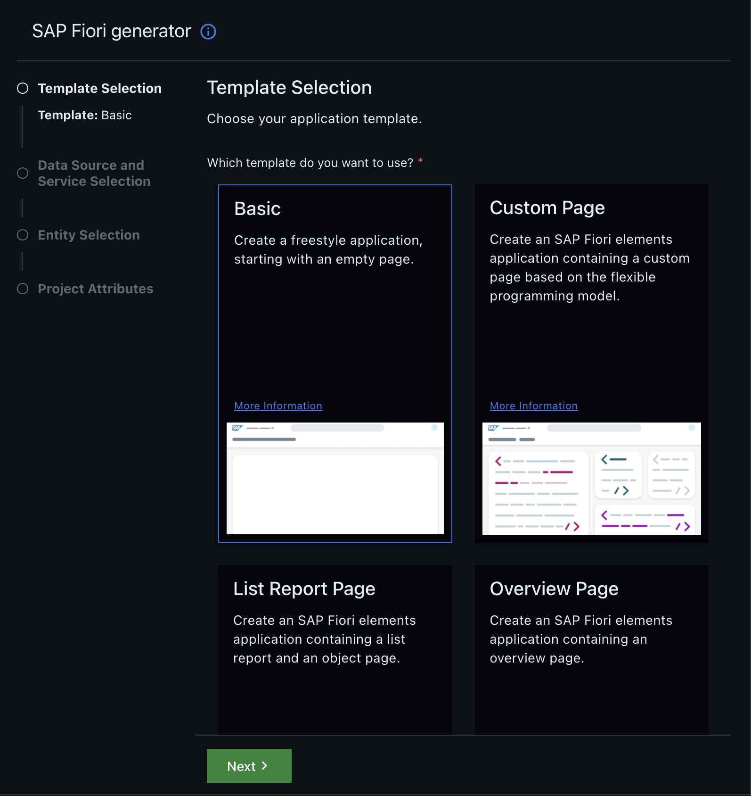
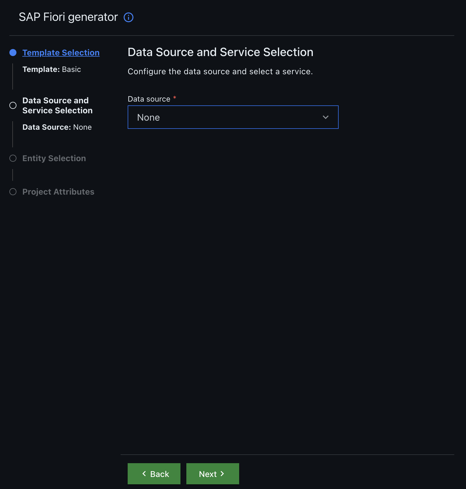
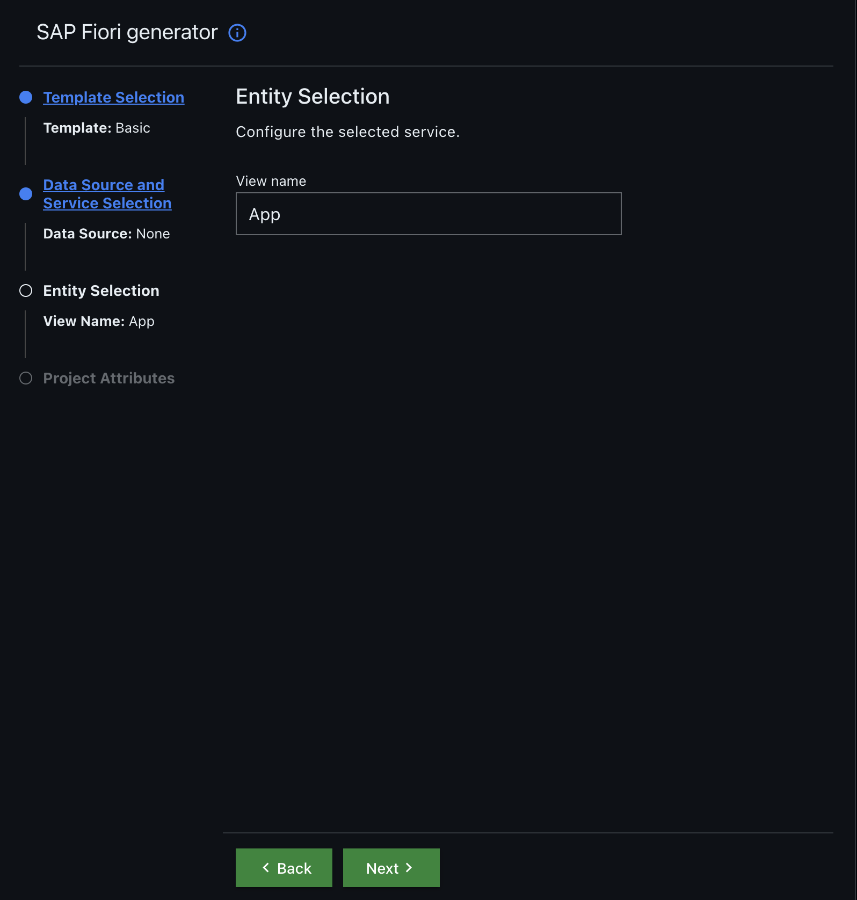
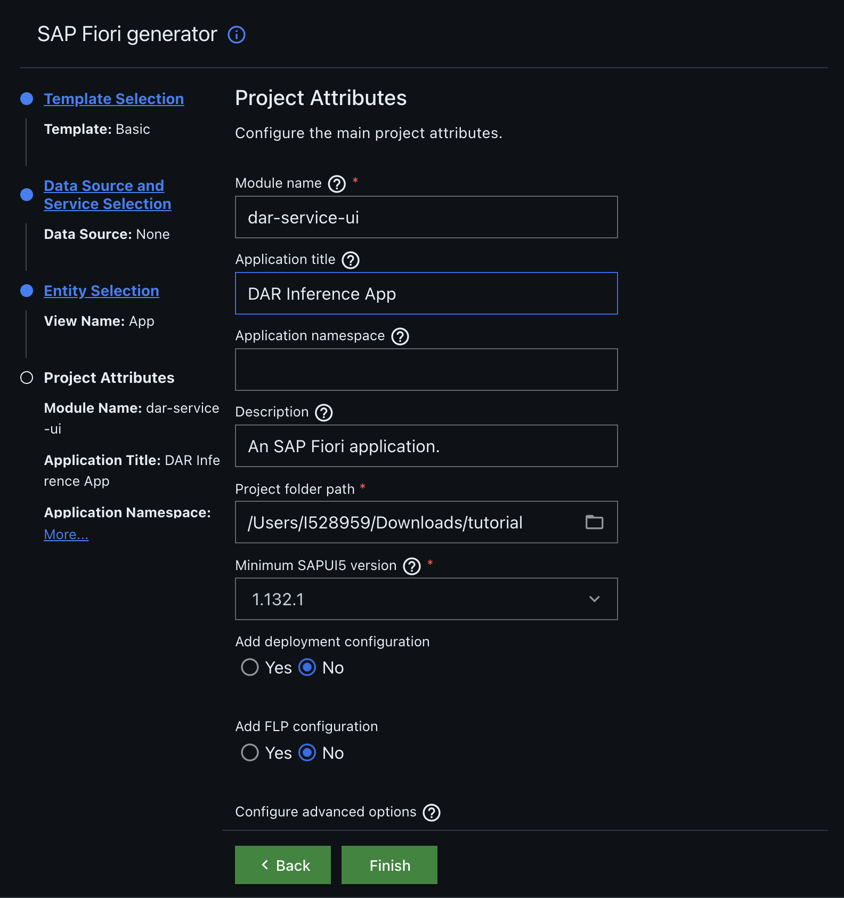

# SAP CAP Java Application Development Guide - Frontend

## Introduction
This guide walks you through the steps to develop an SAP CAP (Cloud Application Programming) Java application that calls a DAR Model for inference using OAuth 2.0 authentication.

## Prerequisites
Ensure you have the following installed:
- Node.js (LTS version)
- Java 11 or later
- Maven
- SAP Business Application Studio or VS Code with CDS plugin
- Postman or Insomnia for testing APIs

---

## Step 1: Create a New SAP UI5 Project
### **Step 1.1: Open Application Generator**
1. To launch the Application Generator, start the command palette from the menu item **View > Command Palette…**, search for **fiori generator**, and select the command **Fiori: Open Application Generator**.

### **Step 1.2: Select Template and Data Source**
2. Specify the template type **SAP Fiori** and select the **Basic** template. Then proceed to the next screen.


### **Step 1.3: Skip Data Source**
3. In the **Data Source** section, select `None` and click on **Next**.

### **Step 1.4: Define View Name**
4. Enter the view name as `App` and click on **Next**.

### **Step 1.5: Complete Project Setup**
5. Provide the **module name** and **application title**, then click on **Finish**.

### **Explanation:** 
In these steps, you're setting up a basic SAP Fiori project. This process generates the default project structure and configures the necessary components like views and controllers for the SAP UI5 application.

---

## Step 2: Modify `package.json`, `ui5.yaml`, and `manifest.json`

### **2.1: Modify `package.json`**
In the `package.json` file, replace the `"scripts"` section with the following code:
```json
"scripts": {
    "start": "ui5 serve -o index.html"
}
```
**Explanation:** This change defines the start script for the application. It uses **UI5** to serve the application and specifies `index.html` as the starting point.

### **2.2: Modify `ui5.yaml`**
In the `ui5.yaml` file, replace the `fiori-tools-proxy` middleware server with the following:
```yaml
  - name: fiori-tools-proxy
    afterMiddleware: compression
    configuration:
        backend:
        - path: /odata/v4
            url: http://localhost:8080
        ui5:
        path: /resources
        url: https://ui5.sap.com
        debug: true
```

make sure the code is properly indented, else error will be thrown.

**Explanation:** The `ui5.yaml` file defines the middleware configurations. This modification ensures that the frontend will use **OData** services, and the correct SAP resources are loaded during development.

### **2.3: Modify `manifest.json`**
In `manifest.json`, add a new data source under the `sap.app` section:
```json
"sap.app": {
    "id": "darserviceui",
    "type": "application",
    "i18n": "i18n/i18n.properties",
    "applicationVersion": {
      "version": "0.0.1"
    },
    "title": "{{appTitle}}",
    "description": "{{appDescription}}",
    "resources": "resources.json",
    "sourceTemplate": {
      "id": "@sap/generator-fiori:basic",
      "version": "1.14.5",
      "toolsId": "9fb95082-cf58-4fdf-b46a-78ad7920aa42"
    },
    "dataSources": {
      "dar_inference": {
        "uri": "/odata/v4/DarService/",
        "type": "OData",
        "settings": {
          "odataVersion": "4.0"
        }
      }
    }
  }
```
Add a new model in the `"models"` of  `"sap.ui"` section:
```json
"DarInferenceModel": {
    "dataSource": "dar_inference",
    "settings": {
        "synchronizationMode": "None",
        "groupId": "$direct",
        "operationMode": "Server",
        "autoExpandSelect": true,
        "earlyRequests": true
    }
}
```
**Explanation:** 
The **manifest.json** file is the metadata of the SAP UI5 application. The data source defines the connection to the OData service for DAR inference. The model specifies how the frontend interacts with the OData service.

---
finally the manifest.json file look like below.

```json
{
  "_version": "1.65.0",
  "sap.app": {
    "id": "darserviceui",
    "type": "application",
    "i18n": "i18n/i18n.properties",
    "applicationVersion": {
      "version": "0.0.1"
    },
    "title": "{{appTitle}}",
    "description": "{{appDescription}}",
    "resources": "resources.json",
    "sourceTemplate": {
      "id": "@sap/generator-fiori:basic",
      "version": "1.14.5",
      "toolsId": "9fb95082-cf58-4fdf-b46a-78ad7920aa42"
    },
    "dataSources": {
      "dar_inference": {
        "uri": "/odata/v4/DarService/",
        "type": "OData",
        "settings": {
          "odataVersion": "4.0"
        }
      }
    }
  },
  "sap.ui": {
    "technology": "UI5",
    "icons": {
      "icon": "",
      "favIcon": "",
      "phone": "",
      "phone@2": "",
      "tablet": "",
      "tablet@2": ""
    },
    "deviceTypes": {
      "desktop": true,
      "tablet": true,
      "phone": true
    }
  },
  "sap.ui5": {
    "flexEnabled": true,
    "dependencies": {
      "minUI5Version": "1.132.1",
      "libs": {
        "sap.m": {},
        "sap.ui.core": {},
        "sap.f": {},
        "sap.suite.ui.generic.template": {},
        "sap.ui.comp": {},
        "sap.ui.generic.app": {},
        "sap.ui.table": {},
        "sap.ushell": {}
      }
    },
    "contentDensities": {
      "compact": true,
      "cozy": true
    },
    "models": {
      "i18n": {
        "type": "sap.ui.model.resource.ResourceModel",
        "settings": {
          "bundleName": "darserviceui.i18n.i18n"
        }
      },
       "DarInferenceModel": {
        "dataSource": "dar_inference",
        "settings": {
          "synchronizationMode": "None",
          "groupId": "$direct",
          "operationMode": "Server",
          "autoExpandSelect": true,
          "earlyRequests": true
        }
      }
    },
    "resources": {
      "css": [
        {
          "uri": "css/style.css"
        }
      ]
    },
    "routing": {
      "config": {
        "routerClass": "sap.m.routing.Router",
        "viewType": "XML",
        "async": true,
        "viewPath": "darserviceui.view",
        "controlAggregation": "pages",
        "controlId": "app",
        "clearControlAggregation": false
      },
      "routes": [
        {
          "name": "RouteApp",
          "pattern": ":?query:",
          "target": [
            "TargetApp"
          ]
        }
      ],
      "targets": {
        "TargetApp": {
          "viewType": "XML",
          "transition": "slide",
          "clearControlAggregation": false,
          "viewId": "App",
          "viewName": "App"
        }
      }
    },
    "rootView": {
      "viewName": "darserviceui.view.App",
      "type": "XML",
      "async": true,
      "id": "App"
    }
  }
}

```
---

## Step 3: Create Views and Controllers for the App

### **3.1: Create `Needs` and `Results` Views**
You need to create the `Needs` and `Results` views to collect user input and display the results.

**Explanation:** These views define the structure of the application’s UI. The `Needs` view collects inputs, while the `Results` view displays the predictions from the DAR model.

The directory structure should look like this:
```
├── webapp/
│   ├── index.html
│   ├── manifest.json
│   ├── view/
│   │   ├── App.view.xml
│   │   ├── Needs.view.xml
│   │   ├── Result.view.xml
│   ├── controller/
│   │   ├── App.controller.js
│   │   ├── Needs.controller.js
│   │   ├── Result.controller.js
```

---

## Step 4: Implement `Needs` View

### **4.1: Modify `App.view.xml`**
In **`App.view.xml`**, replace the `<page>` tag with the `<app>` tag as shown:
```xml
<mvc:View controllerName="darserviceui.controller.App"
    xmlns:mvc="sap.ui.core.mvc" displayBlock="true"
    xmlns="sap.m">
    <App id="app">
    <NavContainer id="navContainer">
      <mvc:XMLView id="needsView" viewName="darserviceui.view.Needs" />
      <mvc:XMLView id="resultView" viewName="darserviceui.view.Result" />
    </NavContainer>
  </App>
</mvc:View>
```
**Explanation:** This code defines the structure of the main view and sets up navigation between the `Needs` and `Result` views using a **NavContainer**. 

### **4.2: Modify `Needs.view.xml`**
In **`Needs.view.xml`**, add the following content:
```xml
<mvc:View
	controllerName="darserviceui.controller.Needs"
	xmlns="sap.m"
	xmlns:mvc="sap.ui.core.mvc"
>
	<Panel
		headerText="{i18n>needPaneltxt}"
		class="sapUiResponsiveMargin"
		width="auto"
	>
		<VBox id="formContainer">
			<!-- Form elements will be added dynamically here -->
		</VBox>
		<HBox justifyContent="End">
			<Button text="Show Product" press="onShowProduct" />
		</HBox>
	</Panel>
</mvc:View>
```

add `needPaneltxt = Needs` to the `dar-service-ui/webapp/i18n/i18n.properties` file 

**Explanation:** This code defines the layout of the `Needs` view. It includes a **Panel** that dynamically adds form elements (fields) based on the product data and a button to trigger the product inference.

### **4.3: Modify `Needs.controller.js`**
In **`Needs.controller.js`**, add the following logic:
```js
sap.ui.define([
  "sap/ui/core/mvc/Controller",
  "sap/ui/model/json/JSONModel",
  "sap/m/MessageToast",
  "sap/m/MessageBox",
  "sap/m/Label",
  "sap/m/Select",
  "sap/ui/core/Item",
  "sap/ui/layout/GridData"
], function (Controller, JSONModel, MessageToast, MessageBox, Label, Select, Item, GridData) {
  "use strict";

  return Controller.extend("darserviceui.controller.Needs", {
    onInit: function () {
      var oModel = new JSONModel();
      this.getView().setModel(oModel);

      // Load needs.json and create form elements
      var that = this;
      $.getJSON("needs.json", function(data) {
        that.createFormElements(data.product);
      });
    },

    createFormElements: function(products) {
      var oVBox = this.getView().byId("formContainer");
      var oHBox;
      products.forEach(function(product, index) {
        if (index % 3 === 0) {
          oHBox = new sap.m.HBox({ justifyContent: "SpaceBetween" });
          oVBox.addItem(oHBox);
        }
        var oLabel = new Label({
          text: product.need_Attribute,
          labelFor: "select" + index
        });
        var oSelect = new Select({
          id: "select" + index,
          width: "200px",
          items: [
            new Item({ key: "", text: "" })
          ].concat(product.characteristicvalues.map(function(value) {
            return new Item({
              key: value,
              text: value
            });
          }))
        });
        var oVBoxItem = new sap.m.VBox({
          items: [oLabel, oSelect]
        });
        oVBoxItem.setWidth("33%");
        oHBox.addItem(oVBoxItem);
      });
    },

    onShowProduct: function() {
      var oModel = this.getOwnerComponent().getModel("DarInferenceModel"),
          oListBinding = oModel.bindList("/Root");
      var oPayload = this.getpayload();

      this.oContext = oListBinding.create(oPayload, true);
      var that = this;
      this.oContext.created().then(
        function (data) {
          try {
            var resultData = JSON.parse(that.oContext.getValue().Response.responseText);
            console.log(resultData);
            MessageToast.show("Success");
            var oNavContainer = that.getOwnerComponent().getRootControl().byId("navContainer");
            var oResultView = oNavContainer.getPages().find(page => page.getId().includes("resultView"));
            oResultView.getController().setResponseData(resultData);
            oNavContainer.to(oResultView);
          } catch (e) {
            MessageBox.error("Incomplete response returned from backend."+e);
          }
        }
      ).catch(function(oError) {
        MessageToast.show("Error: " + oError.message);
        that.oContext.delete("$direct");
      });
    },

    getpayload: function() {
      var inputs = this.getView().findAggregatedObjects(true, function(oControl) {
        return oControl.isA("sap.m.Select");
      });

      var features = inputs.map(function(select, index) {
        return {
          name: select.getParent().getItems()[0].getText(),
          value: select.getSelectedKey()
        };
      });

      return {
        topN: 2,
        objects: [
          {
            features: features
          }
        ]
      };
    }
  });
});
```
**Explanation:** This controller handles the logic for the **Needs** view. It initializes the model, loads the product data (from `needs.json`), and dynamically creates form elements. The `onShowProduct` function gathers the user inputs, calls the backend service for inference, and displays the results.

### **4.4: Create `needs.json`**
Create a `needs.json` file in the `webapp` folder with the product attributes and their corresponding values. This JSON file is used to dynamically generate the form in the **Needs** view:
```json
{
    "product":[
      {
        "need_Attribute": "K_V_ANL_P_BETR",
        "characteristicvalues": ["10", "12", "13", "14", "15"]
      },
      {
        "need_Attribute": "K_V_LIEFERME_P",
        "characteristicvalues": ["100", "102", "103", "104", "105"]
      },
      {
        "need_Attribute": "K_V_NETZ",
        "characteristicvalues": ["10", "12", "13", "14", "15"]
      },
      {
        "need_Attribute": "K_V_OPT_FU",
        "characteristicvalues": ["10", "12", "13", "14", "15"]
      },
      {
        "need_Attribute": "K_V_OPT_T",
        "characteristicvalues": ["10", "12", "13", "14", "15"]
      },
      {
        "need_Attribute": "K_V_OPT_WK",
        "characteristicvalues": ["10", "12", "13", "14", "15"]
      },
      {
        "need_Attribute": "K_V_OPT_AIRC",
        "characteristicvalues": ["10", "12", "13", "14", "15"]
      }
    ]
}
```
**Explanation:** The `needs.json` file contains the data for the form fields in the **Needs** view. Each product has a `need_Attribute` and its associated values.

---

## Step 5: Implement `Results` View

### **5.1: Modify `Result.view.xml`**
In **`Result.view.xml`**, add the following content:
```xml
<mvc:View
  controllerName="darserviceui.controller.Result"
  xmlns:mvc="sap.ui.core.mvc"
  xmlns="sap.m">
  <Page title="Result">
        <content>
            <Table items="{responseModel>/predictions/0/labels/0/results}" class="sapUiResponsiveMargin">
                <columns>
                    <Column><Text text="Value" /></Column>
                    <Column><Text text="Probability (%)" /></Column>
                </columns>
                <items>
                    <ColumnListItem>
                        <cells>
                            <Text text="{responseModel>value}" />
                            <Text text="{= (${responseModel>probability} * 100).toFixed(2) + '%' }" />
                        </cells>
                    </ColumnListItem>
                </items>
            </Table>
        </content>
    </Page>
</mvc:View>
```
**Explanation:** This view displays the inference results in a **Table**. It binds the data to the `responseModel`, which contains the predictions and their probabilities.

### **5.2: Modify `Results.controller.js`**
In **`Results.controller.js`**, add the following logic:
```js
sap.ui.define([
  "sap/ui/core/mvc/Controller"
], function (Controller) {
  "use strict";

  return Controller.extend("darserviceui.controller.Result", {
    onInit: function () {
    },

    setResponseData: function (data) {
            var oModel = new sap.ui.model.json.JSONModel(data);
            this.getView().setModel(oModel, "responseModel");
        }
  });
});
```
**Explanation:** This controller handles the logic for displaying the results. It takes the inference response, sets it in a JSON model, and binds it to the **Results** view.

---

## Step 6: Start the Frontend Application
Run the following command to start the frontend application:
```sh
npm start
```
**Explanation:** This starts the application locally using **UI5** tools. You can now access it in a browser.

---

Here is the troubleshooting section with the provided content:  

---

## **Step 7: Troubleshooting**  

### **Issue 1: MIME Type Error in Console**  
#### **Error Message:**  
```
index.html:1 Refused to execute script from 'http://localhost:8080/resources/sap-ui-core.js' because its MIME type ('text/html') is not executable, and strict MIME type checking is enabled.
```
#### **Possible Cause:**  
This error occurs when the `sap-ui-core.js` script cannot be loaded correctly, usually due to incorrect middleware configurations in `ui5.yaml` or a missing UI5 library.

#### **Solution:**  
Modify the script source in `index.html`. 

Change:  
```html
<script
    id="sap-ui-bootstrap"
    src="resources/sap-ui-core.js"
    data-sap-ui-theme="sap_horizon"
    data-sap-ui-resourceroots='{
        "darserviceui": "./"
    }'
    data-sap-ui-oninit="module:sap/ui/core/ComponentSupport"
    data-sap-ui-compatVersion="edge"
    data-sap-ui-async="true"
    data-sap-ui-frameOptions="trusted"
></script>
```
To:  
```html
<script
    id="sap-ui-bootstrap"
    src="https://sapui5.hana.ondemand.com/resources/sap-ui-core.js"
    data-sap-ui-theme="sap_horizon"
    data-sap-ui-resourceroots='{
        "darserviceui": "./"
    }'
    data-sap-ui-oninit="module:sap/ui/core/ComponentSupport"
    data-sap-ui-compatVersion="edge"
    data-sap-ui-async="true"
    data-sap-ui-frameOptions="trusted"
></script>
```
**Why?**  
- Using the local `resources/sap-ui-core.js` path might not work if the UI5 framework is not served correctly.
- The online version (`https://sapui5.hana.ondemand.com/resources/sap-ui-core.js`) ensures that the latest SAP UI5 library is loaded from SAP's cloud.


---

### **Final Note**  
If the issue persists, ensure your internet connection is stable and check if SAP UI5 is accessible at `https://sapui5.hana.ondemand.com/resources/sap-ui-core.js` in your browser.

## Step 7: Test the Application
1. Open the application in your browser. Enter the required product needs and click on **Show Product**.
2. Wait for the inference results to be displayed. Note: the first request may take some time.

---

### Final Note:
Make sure to use this guide as a framework for development, adjusting configurations as necessary.
